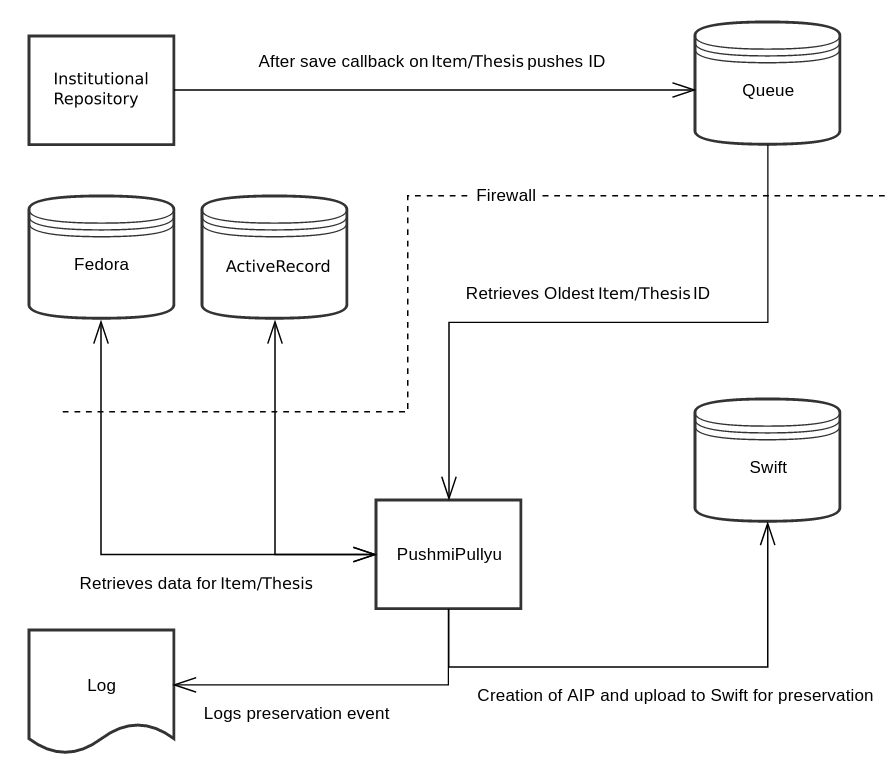

<p align="center">
  <a href="https://github.com/ualbertalib/pushmi_pullyu/">
    
  </a>
</p>

[](https://rubygems.org/gems/pushmi_pullyu)
[](https://gemnasium.com/github.com/ualbertalib/pushmi_pullyu)
[](https://travis-ci.org/ualbertalib/pushmi_pullyu)
[](https://coveralls.io/github/ualbertalib/pushmi_pullyu?branch=master)

PushmiPullyu will be a Ruby application, running behind the firewall that protects our Swift environment.

It's primary job will be to manage the flow of content from Fedora into Swift for preservation.



## Workflow

1.  Any save (Creation/Update) on a GenericFile in ERA will trigger an after save callback which will push the GF information (most likely it's primary ID) into a Queue
2. The queue (will most likely be using Redis) needs to be unique, aka a set (which only allows one GF to be included in the queue at a single time), and ordered by priority from First In, First out (FIFO).
3. PushmiPullyu app will then monitor this queue. After a certain window of wait period has passed since an element has been on the queue, PushmiPullyu will then retrieve the elements off the queue and begin to process the preservation event
4. The GenericFile information and data required for preservation are retrieved from Fedora using multiple REST calls
5. An AIP is created with the GenericFile's information and is bagged.
6. The AIP is uploaded and pushed to Swift via a REST call
7. On a successful Swift upload, a log entry is added for this preservation event


## Requirements

PushmiPullyu supports Ruby 2.3.1+

## Installation

PushmiPullyu is hosted on rubygems.org. Therefore it can be installed via:

```bash
  gem install pushmi_pullyu
```

## Usage

Foreground mode:
```bash
  pushmi_pullyu
```

Run as a daemon:
```bash
  pushmi_pullyu start
```

PushmiPullyu is quite flexible in that many options can be specified at the command line.
Use `pushmi_pullyu --help` to see all the command line options available.

Example:

```
Usage: pushmi_pullyu [options] [start|stop|restart|run]

Specific options:
  -a, --minimum-age AGE            Minimum amount of time an item must spend in the queue, in seconds.
  -d, --debug                      Enable debug logging
  -C, --config PATH                path to YAML config file
  -L, --logfile PATH               Path to writable logfile
  -D, --piddir PATH                Path to piddir
  -N, --process_name NAME          Name of the process
  -m, --monitor                    Start monitor process for a deamon
  -q, --queue NAME                 Name of the queue to read from

Common options:
  -v, --version                    Show version
  -h, --help                       Show this message
```

## Configuration file

You can also provide a configuration file which PushmiPullyu will use with the -C (or --config) flag:

```bash
  pushmi_pullyu start -C /path/to/config
```

By default, if no configuration file is specified, PushmiPullyu will look for a configuration file at config/pushmi_pullyu.yml.

Take the following [sample configuration](https://github.com/ualbertalib/pushmi_pullyu/blob/master/examples/pushmi_pullyu.yml) as inspiration or check out the [DEFAULTS hash](https://github.com/ualbertalib/pushmi_pullyu/blob/master/lib/pushmi_pullyu.rb) in the main module to see all available options.

Options passed on the command line will also override options specified in the config file.

## Signals

PushmiPullyu responds to these signals:

* `INT`: Equivalent of sending Ctrl-C to PushmiPullyu. Will attempt to finish then exit.
* `TERM`: Similar to `INT`. PushmiPullyu will attempt to finish then exit.
* `HUP`: Reopens log files as defined in logfile configuration options.

## Development

After checking out the repo, run `bin/setup` to install dependencies. Then, run `rake spec` to run the tests. You can also run `bin/console` for an interactive prompt that will allow you to experiment.

To install this gem onto your local machine, run `bundle exec rake install`. To release a new version, update the version number in `version.rb`, and then run `bundle exec rake release`, which will create a git tag for the version, push git commits and tags, and push the `.gem` file to [rubygems.org](https://rubygems.org).

## Testing

To run the test suite:

```bash
  bundle install
  bundle exec rake
```

This will run both rspec and rubocop together.

To run rspec by itself:

```bash
  bundle exec rspec
```
To run rubocop by itself:

```bash
  bundle exec rubocop
```

## Deployment

TODO: Fill me out

## License

The gem is available as open source under the terms of the [MIT License](http://opensource.org/licenses/MIT).

